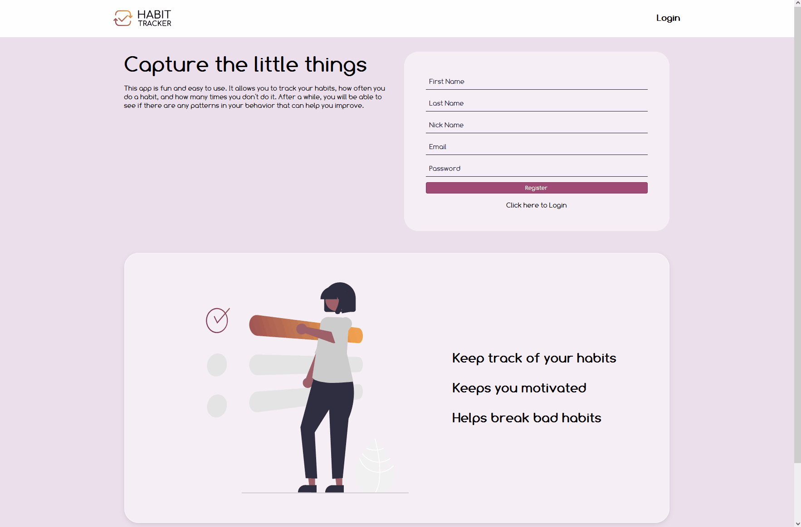
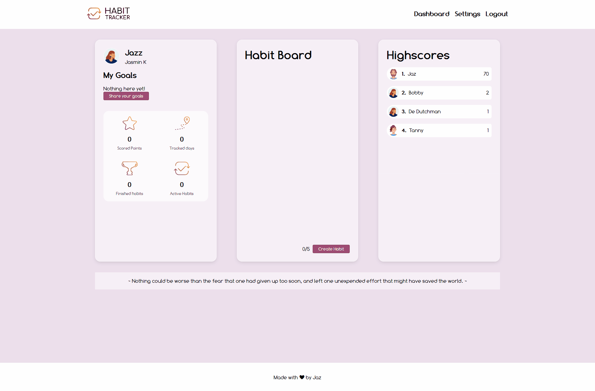
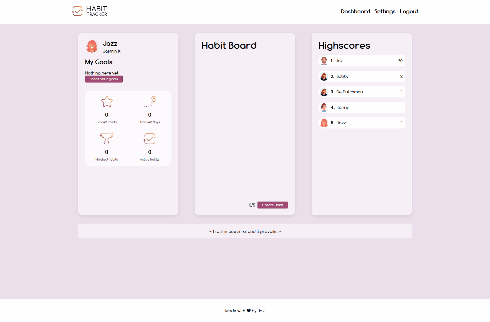
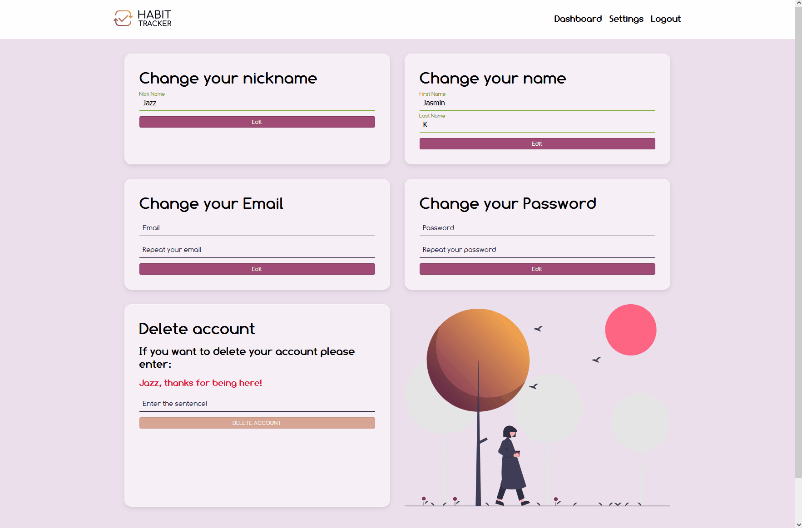

# habit-tracker

_Finale project done during the SPICED academy Full Stack Web Development bootcamp_

## Tools & Technologies

-   ReactJS
-   Node.js/ Express.js
-   PostgreSQL
-   Socket.io
-   CSS

## Project Overview

-   Registration and Login page (with error display)
-   Bcrypt for password protection
-   Choose avatar from a image collection
-   Write goals in the profile viewable for everybody
-   Dashboard with personal scoring, habit board and highscore
-   Live highscore with socket.io
-   Settings: change name, nickname, email or password (all with error messages)
-   Delete account with simple sentence check
-   API used to show random motivational quotes

-   Project is optimized for mobile devices

### Homepage

Register and Login with error messages

<kbd></kbd>

### Dashboard

Everything in on view. Change your goals, edit your habit, see your score and the over all highscore and check what other user do.

<kbd></kbd>

### Avatar Modal

Choose a avatar with a bigger preview

<kbd></kbd>

### Habit

Create up to five habits or delete them. Check the every day, if a day got missed it got crossed out and stopped the day streak. Reset a habit anytime.

<kbd></kbd>

### Settings

Change all your informations
Delete profile Button is only usable if the sentence is correct

<kbd></kbd>

---

### Conclusion

_This project needs some refining, its only made in 5 days_

-   The Database structure is not ideal yet, plan to rewriting it
-   Implementing Redux to easier track any changes
-   Reconsider the tracking of the habits
-   CSS optimization
-   positive feedback for settings changes

#### Possible future Bonus Features:

-   Changing the how many days per week to do the habit and to choose which days it this should be, or on the fly adding these days per running week
-   habit reminder maybe on a specific time
-   User search
-   Most tracked habits

---

### Miscellaneous

Logo and icons designed by me 
Avatar images: <a href="https://www.freepik.com/free-vector/happy-people-avatars_7085154.htm#query=profile&position=48&from_view=keyword">Multiracial people avatars</a> and
<a href="https://www.freepik.com/free-vector/multiracial-people-avatars_7085153.htm#query=profile&position=26&from_view=keyword">Happy people avatars</a> by pikisuperstar on Freepik 
Illustrations: by <a href="https://undraw.co/">unDraw</a>
